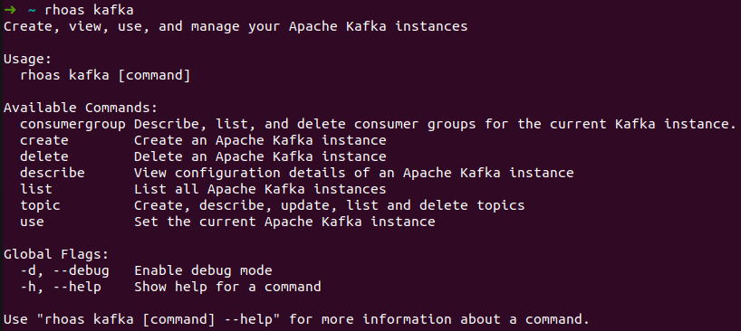

# RHOAS CLI

 

With the rhoas command-line interface (CLI), you can manage your application services from a terminal.

## Documentation

See our [Guides](https://github.com/redhat-developer/app-services-guides/tree/main/rhoas-cli) for installation and usage instructions.

## Installation

RHOAS CLI can be installed in the following operating systems:

* [Linux](https://github.com/redhat-developer/app-services-guides/tree/main/rhoas-cli#installing-the-rhoas-cli-on-windows)
* [macOS](https://github.com/redhat-developer/app-services-guides/tree/main/rhoas-cli#installing-the-rhoas-cli-on-windows)
* [Windows](https://github.com/redhat-developer/app-services-guides/tree/main/rhoas-cli#installing-the-rhoas-cli-on-windows)

## Commands

See the [Command-Line Reference](./docs/commands/) section for details of all available commands and options.

## Contributing

Check out the [Contributing Guide](./CONTRIBUTING.md) to learn more about the repository and how you can contribute.

## License
Copyright (c) Red Hat, Inc. All rights reserved.

Licensed under the [Apache](LICENSE) license.