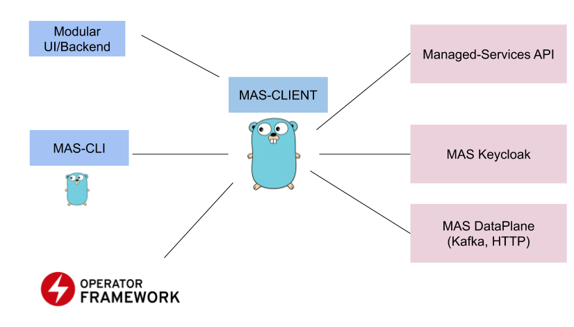

## RHMAS CLI

## Prerequisites

* [OpenAPI Generator](https://openapi-generator.tech/docs/installation/)
* [Golang](https://golang.org/dl/)

## Quickstart 

1. Build and install

`make install`

2. Use

`rhmas`

## Development commands

```
OpenShift Managed Services CLI

make verify                     verify source code
make lint                       run golangci-lint
make binary                     compile binaries
make install                    compile binaries and install in GOPATH bin
make test                       run unit tests
make test-integration           run integration tests
make code/fix                   format files
make generate                   generate go and openapi modules
make openapi/pull                       pull openapi definition
make openapi/generate           generate openapi modules
make openapi/validate           validate openapi schema
make clean                      delete temporary generated files
```

## Other Tools included

- CLI (./cmd) - CLI for managed-services-api written in Golang
- API CLient (./client) - API client written in golang that will be used in the CLI
- Mock  (./mas-mock) - Mock server for managed API (used only to demo flows an extra cases)
- .openshift - templates and scripts that can be used to replicate managed kafka using your own cluster

## Architecture



## Development commands

When working with cmd we can execute commands using go run

```
go run ./cmd kafka create --name=test --multi-az="true" --provider=aws --region=eu-west-1
```


