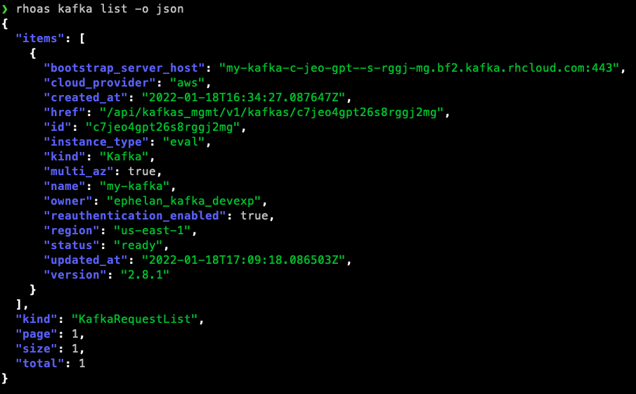

## Introduction

### Conventions used in these guidelines

The requirement level keywords "MUST", "MUST NOT", "REQUIRED", "SHALL", "SHALL NOT", "SHOULD", "SHOULD NOT", "RECOMMENDED", "MAY", and "OPTIONAL" used in this document (case insensitive) are to be interpreted as described in [RFC 2119](https://www.ietf.org/rfc/rfc2119.txt).

## Output

### **MUST** use `stderr` when printing human-readable output

The rhoas CLI is used mostly by humans, and so we should consider carefully how we output data to the user.
Anything that can not be interpreted by a machine **MUST** be output through the `stderr` output stream. Examples of what is human-readable include:

* Error messages
* Help text
* Paragraphs, sentences or isolated words/phrases written using natural language
* Anything which would break machine-readable output

### **MUST** use `stdout` when printing machine-readable output

Secondary to the primary user of the rhoas CLI (humans), machines **MUST** also be able to read the output (in appropriate commands). This is done to make it possible to write scripts that use the rhoas CLI, but it can also help the usability for humans, such as combining JSON output with `jq` to query data. Some data which is unnecessary for most cases may be omitted from the human-readable data output to improve readability, but users may also want to view the full payload.

### **MUST** internationalize text strings in `stderr`

The CLI internationalizes all text strings (with the exception of debug messages) to allow it to be usable in multiple languages. The only supported language as of now is English ("en").

### **MUST** output a list of items to a table by default

When displaying a list of items, it **MUST** be output into a table format by default. The CLI uses a standard table format and provides libraries to do so in consistency with the other tables.

An `--output` flag **MUST** be provided to enable the user to output the list in either JSON or YAML format.

### **SHOULD** display output on success

When a command has finished executing successfully, brief text should be output to update the user.

It is **RECOMMENDED** to prefix a success message with a green check mark "✔️" for Unicode compatible shells.

### **SHOULD** display an error message on command fail

When an error has occured during command execution a clear and concise error message **SHOULD** be printed before exiting the program.

### **MAY** use color in human-readable output where it enhances readability

The use of color **MAY** be used if you feel that its additional will improve readability of the output. Avoid overuse of color and limit the range of colors used.

The [`color`](https://pkg.go.dev/github.com/redhat-developer/app-services-cli@v0.37.1-beta3/pkg/core/ioutil/color) package provides a number of APIs which provided common colors according to how they should be used.

### **SHOULD** allow the user to disable color output

User's may need or want color output disabled. When the `NO_COLOR` enviroment variable is set then the additional of ANSI color to the output should be prevented.

### **SHOULD NOT** display any animations in `stdout`

Animations should only be displayed in `stderr`, as `stdout` needs to be kept for machine-readable output.

### **MAY** use symbols and emoji where it makes things clearer

Symbols and emojis can sometimes tell more than words can and they can also be useful to draw someone's attention to something.
By default all error messages are prefixed with a ❌ to highlight that something went wrong. When a symbol is used more than once it becomes a pattern and should always mean the same thing.

Be careful and don't overdo it - too many symbols can dilute their significance and can make the application look like a toy.

### **MUST** use color in all JSON and YAML output

All JSON and YAML output **MUST** be syntax highlighted by default.

**JSON:**

**YAML:**

### **SHOULD** tell the user when a command changes the state of the system

When a command changes the state of the system (either local or remote), it is good practice to tells the user what just happened so they can update their mental model of the current system state.

You may prefix state change notifications with an info "ℹ" icon to highlight the notification.

### **MAY** suggest commands for the user to run

When several commands are used regularly as part of a common workflow, it is a good idea to suggest to the user commands that they could or should run next. Doing so can help the user quickly learn how to use the library and reduces the need to look to extenal sources such as web-based documentation to find out what to do next.

In the previous image in [**SHOULD tell the user when a command changes the state of the system**](#should-tell-the-user-when-a-command-changes-the-state-of-the-system) you can see that the output suggests running `rhoas status` next if the user wants to monitor the creation status of the Kafka instance.

### **SHOULD** indent bulleted lists by two spaces

Bulleted lists should have an indent of two spaces from the previous text block to make it visually easier to read.

### **MUST NOT** print unnecessary information unless in verbose mode

The signal-to-noise ratio is crucial to provide a better user experience. Omit extraneous information like error codes and HTTP request dumps. If this information could be useful when there is an unexpected error then it should be printed when verbose mode is enabled via the `--verbose` flag.

### **SHOULD** use a pager if you are outputting a lot of text

When there is a large amount of data being output, it is recommended to use a pager (e.g. `less`) to display a suitable amount of data for the current terminal size. You shouldn't use a pager if `stdin` or `stdout` is not an interactive terminal.

## Help

## Input

## Interactivity

## Errors

## Arguments and Flags

## Subcommands

## Robustness

## Backwards Compatibility
